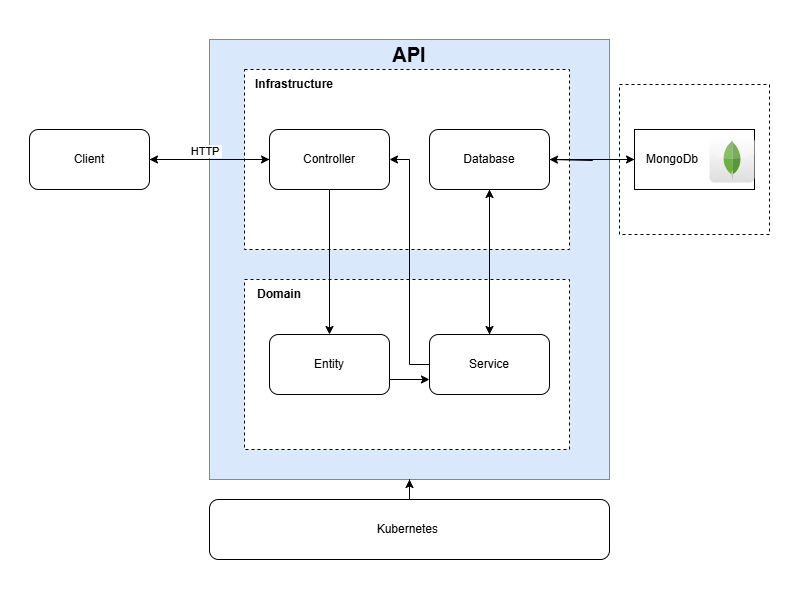
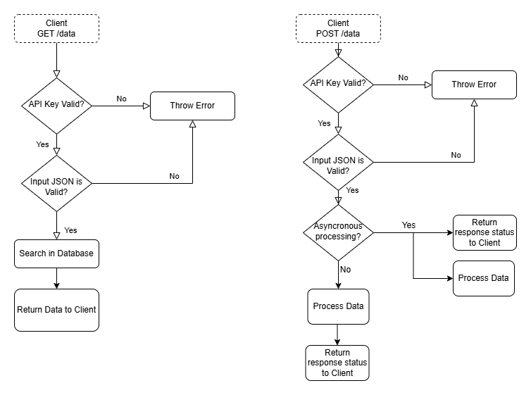

# API Architecture

This microservice follows an adapted Clean Architecture, with separated and independent domains, infrastructure that dependes on the domain layer and an HTTP interface.

The structure prioritizes separation of concerns, framework independence, high cohesion, testability and scalability.
It also allows integration of chaching (Ex. Redis) and queues systems (Ex. RabbitMQ) if needed.


API Architecture Diagram




## Structure
```
api/
|-- src/
|    |-- domain/
|    |   |-- entities
|    |   |-- repositories
|    |   |-- services
|    |-- infrastructure/
|    |   |-- database
|    |   |-- http
|    |-- main.ts
|-- dist/
|-- package.json
|-- tsconfig.json
|-- api.md

```

## Data Flow

 - `GET /health`
    - Route used to validate the API status 
    - The main use is to garante the the livenessProbe functionality from kubernetes.
    - Return usefull information as database conections, memory and CPU use.

 - `GET /data`
    - The controller, located in the `infrastructure/http` folder, validate the input JSON using DTOs.
    - The service is called by the controller, which interacts with the repositories interfaces.
    - The data is retrived by the infrastructure/database implementations.
    - The data is returned to the user in a JSON format.

 - `POST /data`
    - The controller, located in the `infrastructure/http` folder, validate the input JSON using DTOs.
    - The service is called by the controller, which interacts with the repositories interfaces.
    - The input data is validated and processed before being sent to the database.
    - Depending on the type of process,it may run asynchronously, sending a response to the client before persistence is completed, ensuring a fast response time (under 500ms).
    - If necessary, the response can be delayed until the processing and database operations are completed.
    - A queuing mechanism may be applied to increase performance, reduce system load, and minimize the number of active service instances or clusters.
    
    Workflow Diagram
    
    


## Technical Decisions

### Database: `MongoDb`
- Considering the focus on performance, data volume, and scalability, `MongoDb` was selected. 
    - Mongo supports high horizontal scalability and works with structured JSON. - It provides a fast read and write operations.
    - It can also replicate data to a relational Database if needed without impacting on real-time operation.

### Stack: `Typescript`
- By using Node.js + Typescript, we gain a robust, type-safe and mantainable codebase.
- Express may be used to handle HTTP and REST requests.
- Data manipulation and validation can be done by using Zod and Lodash. 

## Authentication
 - API Key validation is performed through middleware at the HTTP layer.
 - The /health route is publicly accessible to allow external monitoring and readiness checks.
 - The API Key approach was selected due to the absence of details about the api client. It also offer a simple, effective and lightweight solution to increase security.
 - The API Key can be easealy change by a JWT or OAuth strategy if needed.

## Error Handling
 - Global Exception Handler middleware responsible for treating errors, formatting responses and logging.
 - Error handling included in the test cases.


## Test Covarage

- Following a Test-Driven Development (TDD approach), the goal isto maintain at least 80% coverage, focusing in busines rules, edge cases, unit tests and integration scenarios.
- `Vitest` is used for unit testing, and `Supertest` is used for HTTP-level integration tests.
- Unit tests are written for specific business logic and utility functions.
- Integration tests validate the behavior between layers and full request flows.
- All tests are executed in a Continuous Integration (CI) pipeline to ensure code integrity before deployment.
