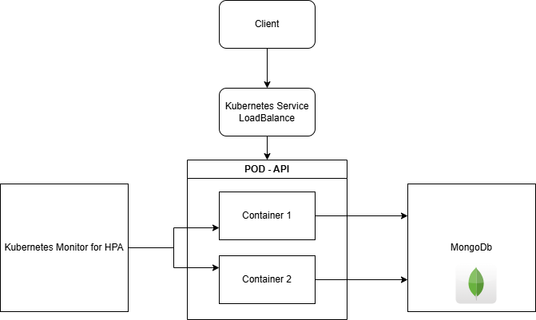

# Kubernetes

Kubernetes is used to orchestrate Deploy and enable Horizontal Scaling of the application.

Kubernets Diagram


## Structure
```
kubernetes/
|-- configmap.yaml
|-- deployment.yaml
|-- service.yaml
|-- hpa.yaml
|-- kubernetes.md

```

## Strategy
 - Horizontal Scaling with HPA
 - Stateless Design and ConfigMap to avoid pod coupling
 - Resourse monetoring for autoscaling decisions

## ConfigMap
 - Centralized environment variable mapping for reuse across pods

    [View configmap.yaml](./configmap.yaml)

## Deployment

 - Starts with 2 pods for high availability
 - Ensure zero-downtime with max of one unavailable pod
 - Liveness probe with route `GET /health` checking
 - Loads environment variables via ConfigMap

    [View deployment.yaml](./deployment.yaml)

## Service
 - Type `LoadBalancer` to handle high request volume and allow external access

    [View service.yaml](./service.yaml)

## Horizontal Pod Autoscaler
 - Automatic scales from 2 to 10 pods based on CPU and memory usage
 - Target of 70% of usage

    [View hpa.yaml](./hpa.yaml)


## Roadmap
 - Logging and observation may be added with Grafana, Open Telemetry and Zabix