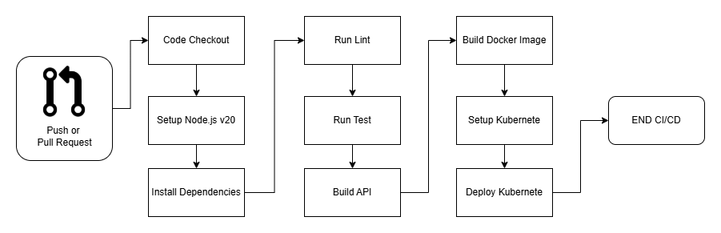

# Pipelines

This API uses Github Action to automate linting, testing, building and deployment. This ensures a consitent development pattern and improve code safety, enabling continuous delivery.

CI/CD Diagram


## Structure
```
pipelines/
|-- .github
|     |-- ci-cd.yml
|-- pipelines.md

```

## Pipeline Flow

 - Checkout code from repository
 - Setup Node.js v20
 - Install dependencies
 - Run Lint
 - Run Test Coverage
 - Build API
 - Build Docker image
 - Deploy to Kubernetes

  [View CI/CD](./.github/workflows/ci-cd.yml)

## Key features
 - Enviroments with only one CI/CD
 - Ensure Code patterns
 - Ensure Funcionalities by running test
 - Automatic Deployment

